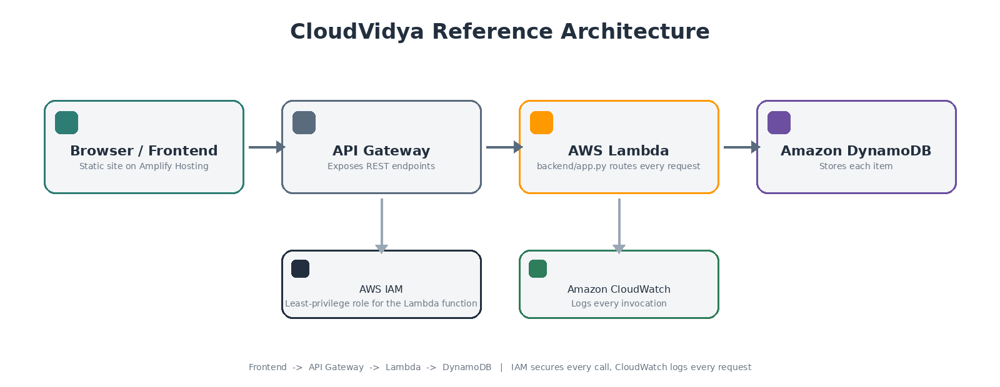

# Project Guide

## Architecture



The same shape taught on Day 1: your browser talks to API Gateway, which
routes to a single Lambda function (`backend/app.py`), which reads and
writes DynamoDB. IAM gives that Lambda function only the permissions it
needs on that one table; CloudWatch logs every invocation automatically.

## API design

| Method | Route          | Purpose                                   |
|--------|----------------|--------------------------------------------|
| GET    | `/health`      | Confirm the API is running                 |
| POST   | `/items`       | Create a new submission                    |
| GET    | `/items`       | List all submissions                       |
| PATCH  | `/items/{id}`  | Update status — **optional, for those who go further** (not implemented in the starter; see the `TODO` in `backend/app.py`) |

`POST /items` and `GET /items` are the minimum viable project. Everything
else — status updates, authentication, file uploads, notifications,
dashboards — is an optional extension for Challenge 3, not a requirement.

## Sample DynamoDB record

```json
{
  "id": "generated-id",
  "title": "Broken classroom projector",
  "description": "The projector in Room 204 is not working.",
  "category": "Infrastructure",
  "status": "OPEN",
  "participantName": "Priya Shah",
  "createdAt": "2026-09-08T10:30:00Z"
}
```

Add or remove fields to fit your theme (see
`project-themes/problem-statements.md`) — just keep `id` and `createdAt`,
since the frontend and the sort order in `_list_items()` both depend on them.

## Deployment flow (Day 2)

1. Fork this repository, then clone your fork.
2. Change `frontend/config.js` — `APP_NAME` and `APP_THEME_COLOR` — to match
   your theme.
3. Read `backend/app.py` — understand the four routes, the environment
   variable, and the IAM policy in `template.yaml`.
4. Deploy the backend:
   ```bash
   sam build
   sam deploy --guided
   ```
5. Copy the printed `ApiUrl` into `frontend/config.js`.
6. Test creating and listing items locally (open `frontend/index.html`
   directly in a browser, or serve it with any static server).
7. Commit and push your changes to GitHub.
8. In the AWS Console, open **Amplify → Host web app**, connect your GitHub
   fork, and point it at the `frontend/` folder. Amplify redeploys
   automatically on every push from here on.
9. Open the deployed URL, test it live, and check **CloudWatch → Log
   groups** for your Lambda function to see the requests you just made.
10. Make one visible change, push it, and watch Amplify redeploy — this is
    the "Git push = deploy" workflow the whole exercise is demonstrating.
11. Save your repository URL, deployed URL, and this architecture diagram —
    you'll need all three for the final submission.

## Extending for Challenge 3 (optional — open book)

Ideas, roughly in order of effort:

- Implement `PATCH /items/{id}` (the `TODO` in `backend/app.py`)
- Add a status filter or search box to the frontend
- Add file uploads via S3 (a new bucket + presigned URLs)
- Add authentication via Amazon Cognito, so submissions are tied to a user
- Add notifications (SES email, or an SNS topic) when a new item is created
- Add a simple analytics view (counts by category/status)

None of these are required. The evaluation rubric rewards understanding and
thoughtful customization over how many extensions you bolt on — a small,
well-explained MVP with a customized theme scores better than a copied
unrelated project you can't explain yourself.

## Cleanup (required after evaluation)

```bash
sam delete --stack-name <your-stack-name>
```

Also delete the Amplify app (**Amplify → your app → Actions → Delete app**)
and remove your fork if you don't want to keep it. This mirrors the Day 1
"Security and Cost Awareness" lesson: monitor usage, and remove resources
once you're done evaluating them.
